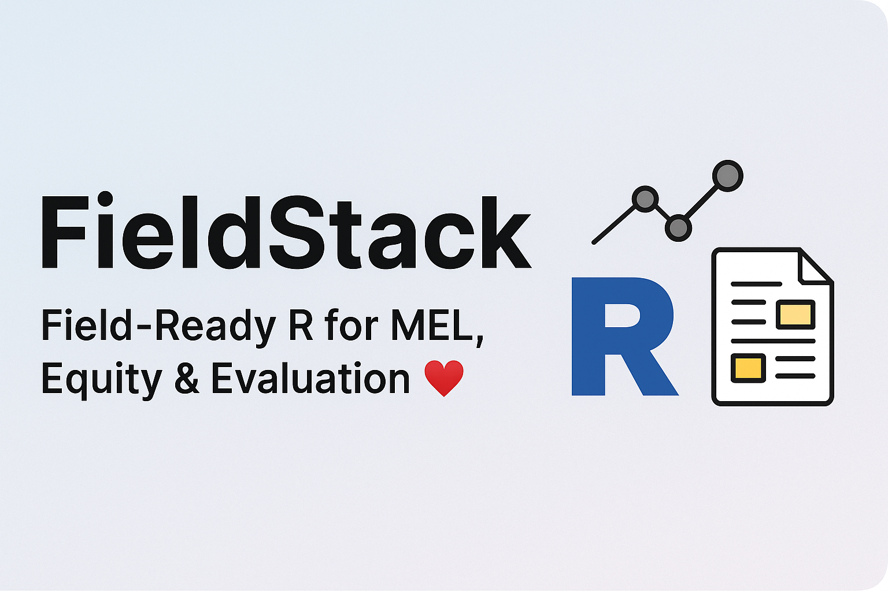

  

<!-- TOC START -->
## 📚 Table of Contents

- [What’s Inside](#-whats-inside)
- [How to Use](#-how-to-use)
- [Citation](#-citation)
- [Repository Status & Metadata](#-repository-status--metadata)
- [Related Repositories](#-related-repositories)
- [License](#-license)

<!-- TOC END -->


# FieldStack 📊

Reusable R Scripts, Notebooks, and Sample Data for Evaluation, MEL, and Social Research


---

## 👋 Welcome

**FieldStack** is a personal, open-source collection of reusable R code, Quarto notebooks, and sample datasets that I’ve developed over years of working in public health, gender equity, education, climate resilience, and MEL.

It’s meant for:
- Researchers and MEL professionals needing clean, modular R logic
- Students looking for working examples tied to real development problems
- Field practitioners building quick summaries, dashboards, or insights

Every script and notebook runs out of the box using included data.  
Everything is tested, documented, and designed to reflect **real South Asian fieldwork needs**.

---

## 📦 Included Modules (2025)

Each module includes:
- `scripts/`: R logic with examples
- `notebooks/`: Visual walkthroughs in `.qmd`
- `sample_data/`: District-level datasets
- `tests/`: Validation with `testthat`

| Sector       | Notebook                            | Description                                                                 |
|--------------|--------------------------------------|-----------------------------------------------------------------------------|
| Gender       | `gender_labour_summary.qmd`         | Weighted female employment summary from survey-style data                  |
| Public Health| `public_health_index.qmd`           | Health access index using PHC, CHC, and subcentre availability             |
| Education    | `education_summary.qmd`             | District- and gender-wise school pass rates                                |
| Climate      | `climate_risk_summary.qmd`          | Vulnerability index using flood, drought, and temperature variability      |
| MEL          | `mel_dashboard_summary.qmd`         | Wide-to-long reshaping for Power BI/Looker dashboards                      |

---

## 🧪 How to Use

- 🔁 Clone the repo or download ZIP
- 📊 Open any `.qmd` in RStudio to explore summaries
- 🧪 To run all tests:
  ```r
  source("tests/run_all_tests.R")
  ```

To export dashboard-ready CSVs, use the MEL module or edit any notebook’s output block.

---

## 📁 Folder Map

```
FieldStack/
├── scripts/         # Core reusable R functions
├── notebooks/       # Quarto notebooks (runnable)
├── tests/           # Unit tests
├── sample_data/     # Example CSVs for each use case
├── banner/          # Banner image
```

---

## 🔗 Related

🌐 Also see:  
**EquityStack** → Python + Jupyter + Notebooks for social data  
🔗 [github.com/Varnasr/EquityStack](https://github.com/Varnasr/EquityStack)

---

## 📊 Repository Status & Metadata

[](LICENSE)  
[](https://github.com/Varnasr/FieldStack/actions)  
[]()

---

## 📜 License

MIT License — feel free to fork, reuse, or build on this work.

---

## 🧾 Citation

```bibtex
@misc{sriraman2025fieldstack,
  author       = {Varna Sri Raman},
  title        = {FieldStack: Reusable R Code for MEL, Evaluation, and Social Data},
  year         = {2025},
  howpublished = {\url{https://github.com/Varnasr/FieldStack}},
  note         = {GitHub repository}
}
```

---

## ✉️ Contact

- 📧 varna[DOT]sr [AT] gmail [DOT] com  
- 🌐 [varnasr.github.io](https://varnasr.github.io)  
- 🧵 [Threads](https://www.threads.net/@varnasriraman)  
- 💼 [LinkedIn](https://www.linkedin.com/in/varna)


---

## 🧠 Why FieldStack?

This repository reflects my approach to building transparent, reusable, and field-adapted tools for the social sector — especially in the Indian and South Asian context.  

I believe good evaluation tools should be:
- Easy to adapt 🧩
- Easy to test 🔍
- Easy to learn from 📚

You're welcome to explore, borrow, cite, fork — or reach out with your own use cases.

Thanks for visiting ✨  
– Varna

